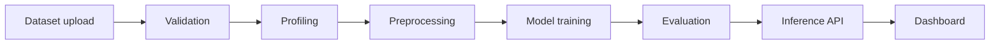

# AutoML Forge

This repository is the foundation for an end-to-end AutoML platform designed to validate, profile, preprocess, train, compare, and deploy machine learning models for tabular datasets.

## Phase 1: project foundation

This initial milestone establishes the project layout, configuration, environment, logging, and package conventions needed for production-oriented development.

## Architecture



## Project structure

```text
.
├── README.md
├── pyproject.toml
├── requirements.txt
├── Makefile
├── .gitignore
├── .env.example
├── configs/
│   ├── default.yaml
│   ├── classification.yaml
│   └── regression.yaml
├── src/
│   └── automl_forge/
│       ├── __init__.py
│       ├── config/
│       ├── data/
│       ├── preprocessing/
│       ├── training/
│       ├── utils/
│       ├── exceptions.py
│       └── ...
├── tests/
│   └── unit/
└── api/
```

## Installation

```bash
python3 -m venv .venv
source .venv/bin/activate
pip install -r requirements.txt
```

## Run tests

```bash
pytest -q
```

## Notes

This is intentionally a clean foundation for the subsequent data-engine, preprocessing, model-registry, training, API, and frontend phases.
